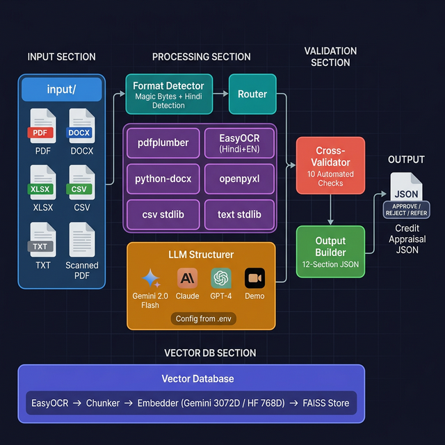
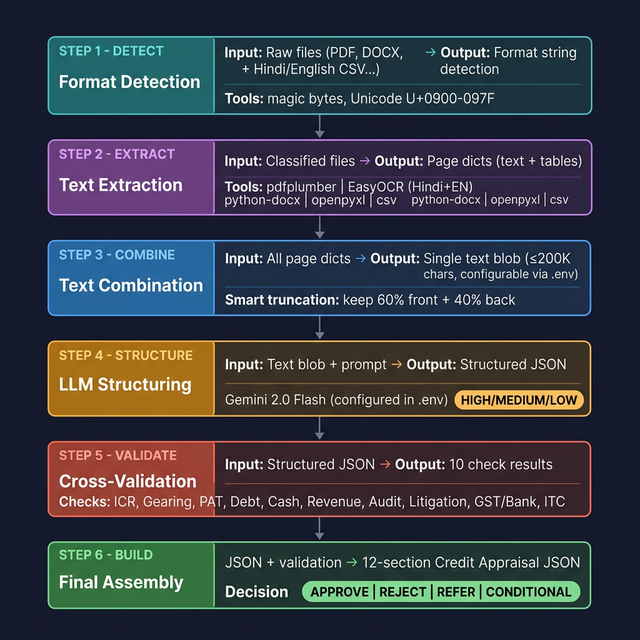
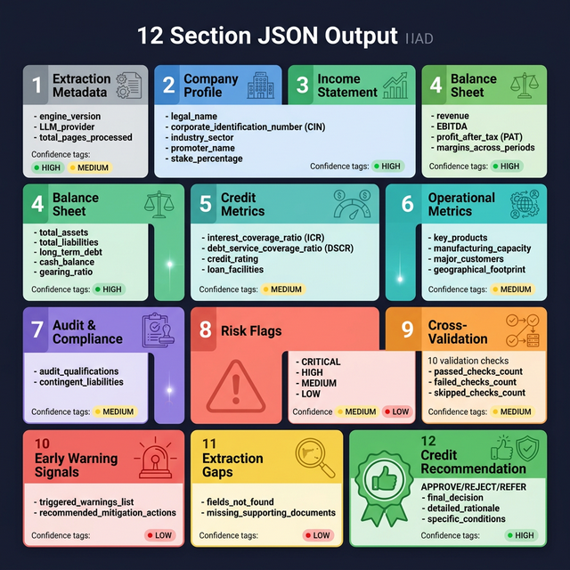

# Intelli-Credit: Data Ingestion Pipeline

> **Module:** Extractor Pipeline
> **Purpose:** Ingest multi-format financial documents and produce structured JSON for credit appraisal

---

## System Architecture



The pipeline accepts **6 document formats** from the `input/` folder, classifies them using magic-byte detection + Hindi/Devanagari script detection, routes each to a specialized extractor, combines all extracted text, sends it to a configurable LLM (Gemini → Claude → OpenAI, with all models read from `.env`), runs **10 automated cross-validation checks**, and produces a final **12-section Credit Appraisal JSON**.

---

## Data Flow: PDF → Structured JSON



Each stage transforms the data further:

| Stage | Input | Output | Tool |
|-------|-------|--------|------|
| **Detect** | Raw file | Format string + language | `detector.py` (magic bytes + Hindi detection) |
| **Extract** | Raw PDF (132 pages) | List of page dicts with text + tables | `pdfplumber` / `EasyOCR` |
| **Combine** | 132 page dicts | Single text blob (≤200K chars, configurable) | `main.py` |
| **Structure** | Text blob + extraction prompt | Structured JSON with financial fields | Configurable LLM (`.env`) |
| **Validate** | Structured JSON | 10 check results (PASS/FAIL/SKIP) | `cross.py` |
| **Build** | JSON + validation results | Final 12-section output | `builder.py` |

---

## Output JSON Structure



Every field in the output includes a **confidence tag** (`HIGH` / `MEDIUM` / `LOW`) indicating whether the value was found directly in the document, inferred, or estimated.

---

## Configuration (`.env`)

All models, providers, and pipeline parameters are centralized in `.env`:

```ini
# ─── API KEYS ───────────────────────────────────────
GEMINI_API_KEY=your-key-here
HUGGINGFACE_API_KEY=your-hf-key-here

# ─── LLM CONFIGURATION ─────────────────────────────
LLM_PROVIDER=gemini
GEMINI_MODEL=gemini-2.0-flash
ANTHROPIC_MODEL=claude-sonnet-4-20250514
OPENAI_MODEL=gpt-4o
LLM_TEMPERATURE=0.1
MAX_CONTEXT_CHARS=200000

# ─── EMBEDDING CONFIGURATION ───────────────────────
# Primary: gemini | Fallback: huggingface
EMBEDDING_PROVIDER=gemini
GEMINI_EMBEDDING_MODEL=gemini-embedding-001
HF_EMBEDDING_MODEL=sentence-transformers/paraphrase-multilingual-mpnet-base-v2

# ─── OCR CONFIGURATION ─────────────────────────────
# Engine: easyocr (recommended) | tesseract (legacy)
OCR_ENGINE=easyocr
OCR_LANGUAGES=en,hi
OCR_DPI=300

# ─── PIPELINE CONFIGURATION ────────────────────────
CHUNK_SIZE=1000
CHUNK_OVERLAP=200
```

---

## File-by-File Breakdown

### Core Modules

| File | Role | What It Does |
|------|------|-------------|
| `main.py` | **Orchestrator** | Entry point. Iterates through all files in `input/`, calls each pipeline step in order, saves final JSON to `output/`. |
| `core/detector.py` | **Format Classifier** | Reads the first 8 bytes (magic bytes) of each file to determine its true format. For PDFs, samples 10 pages to classify as text-based or scanned. Detects **Hindi/Devanagari** script (Unicode U+0900–U+097F). Exposes `detect_language()` returning `hindi`, `english`, `mixed`, or `unknown`. |
| `core/router.py` | **Dispatcher** | Maps detected format string (e.g. `"pdf_text"`, `"csv"`) to the correct extractor function. |
| `core/llm.py` | **LLM Structurer** | Sends combined extracted text to an LLM (Gemini → Claude → OpenAI, in priority order). **All model names, temperature, and context limits are read from `.env`**. Returns structured credit data as JSON. |

---

### Extractors

Each extractor takes a file path and returns a **standardized list of page dicts**:

```json
[
  {
    "page": 1,
    "text": "extracted text content...",
    "source": "filename.pdf",
    "type": "pdf_text",
    "method": "pdfplumber",
    "has_tables": true
  }
]
```

| File | Format | Library | Key Behavior |
|------|--------|---------|-------------|
| `extractors/pdf_text.py` | Digital PDF | `pdfplumber` | Extracts text **and tables** page-by-page. Tables are converted to pipe-delimited rows under a `[TABLE DATA]` marker so the LLM can parse them. |
| `extractors/pdf_scanned.py` | Scanned PDF | **`EasyOCR`** (default) or `pytesseract` | Converts each page to an image at configurable DPI, runs OCR, and returns text with a confidence score (0–100%). **EasyOCR supports Hindi natively with no system dependencies.** Engine, languages, and DPI all read from `.env`. |
| `extractors/docx.py` | Word (.docx) | `python-docx` | Extracts all paragraphs and tables. Tables are converted to pipe-delimited format. Returns the entire document as one page. |
| `extractors/excel.py` | Excel (.xlsx) | `openpyxl` | Processes each **sheet** as a separate page. Reads computed cell values (not formulas). Skips empty rows. |
| `extractors/csv_file.py` | CSV | `csv` (stdlib) | Reads all rows as pipe-delimited text. Handles UTF-8 BOM encoding common in Indian government portal exports. |
| `extractors/txt_file.py` | Plain Text | `open()` (stdlib) | Reads the entire file as a single page. Uses `errors='replace'` for encoding resilience. |

---

### Cross-Validator (`validators/cross.py`)

Runs **10 automated checks** on the LLM-structured data to catch financial red flags:

| Check | ID | Severity | What It Detects |
|-------|----|----------|----------------|
| Interest Coverage Ratio | CV_001 | HIGH | ICR below 1.5x — can't service debt |
| Gearing Ratio | CV_002 | CRITICAL | Debt-to-equity above 2.0x |
| PAT Margin | CV_003 | MEDIUM | Profit margin below 2% |
| Debt Trend | CV_004 | HIGH | Debt growing >30% over review period |
| Cash Trend | CV_005 | HIGH | Cash declining >30% — liquidity stress |
| Revenue Consistency | CV_006 | HIGH | Revenue growth >100% (suspicious) or decline >30% |
| Audit Qualifications | CV_007 | HIGH | Any audit qualifications found |
| Litigation Detection | CV_008 | HIGH | Legal/court/NCLT/IBC keywords in red flags |
| GST vs Bank Mismatch | CV_009 | CRITICAL | Circular trading — GST turnover 30%+ above bank credits |
| ITC Ratio | CV_010 | HIGH | Input Tax Credit ratio above sector benchmark by 50%+ |

---

### Output Builder (`output/builder.py`)

Combines LLM output + validation results into the final 12-section JSON. Also computes:
- **Risk flag aggregation** with severity counts (CRITICAL / HIGH / MEDIUM / LOW)
- **Early warning signals** by scanning for fraud keywords (circular, shell, liquidation, insolvency)
- **Credit recommendation** via a rule-based decision tree (APPROVE / REJECT / REFER / CONDITIONAL)

---

### Vector Database (`vectordb/`)

Persistent vector store for RAG retrieval over ingested documents.

| File | Role | What It Does |
|------|------|-------------|
| `vectordb/embedder.py` | **Embedding Provider** | `get_embedder()` factory returns **Gemini** (3072-dim) or **HuggingFace** (768-dim, multilingual Hindi+English) based on `.env` config. Auto-falls back to HuggingFace if Gemini key is unavailable. |
| `vectordb/chunker.py` | **Document Chunker** | Section-aware splitting for Indian financial docs. Preserves `[TABLE DATA]` blocks, 1000-char chunks with 200-char overlap. |
| `vectordb/store.py` | **FAISS Vector Store** | `IndexFlatIP` with cosine similarity. **Dynamic dimension** — adapts to 3072 (Gemini) or 768 (HuggingFace). Persists to `faiss_store/`. Supports metadata filtering. |
| `vectordb/ingest.py` | **Ingestion Orchestrator** | Extract → Chunk → Embed → Store. Reuses existing extractors. Also ingests structured JSON outputs. |
| `build_vectordb.py` | **Entry Point** | CLI for building, querying, and inspecting the vector DB. |

---

## Supported LLM Providers

All model names are configurable via `.env`:

| Priority | Provider | Model (default) | Context Window | Env Variable |
|----------|----------|-------|---------------|--------------|
| 1st | **Google Gemini** | `gemini-2.0-flash` | 1M tokens | `GEMINI_API_KEY` |
| 2nd | Anthropic Claude | `claude-sonnet-4-20250514` | 200K tokens | `ANTHROPIC_API_KEY` |
| 3rd | OpenAI GPT-4 | `gpt-4o` | 128K tokens | `OPENAI_API_KEY` |
| Fallback | Demo Mode | — | — | No key needed |

## Supported Embedding Providers

| Provider | Model | Dimensions | Languages | Env Variable |
|----------|-------|------------|-----------|--------------|
| **Gemini** (default) | `gemini-embedding-001` | 3072 | Multilingual | `GEMINI_API_KEY` |
| HuggingFace (fallback) | `paraphrase-multilingual-mpnet-base-v2` | 768 | 50+ languages (Hindi + English) | `HUGGINGFACE_API_KEY` |

## Supported OCR Engines

| Engine | Languages | System Dependencies | Env Variable |
|--------|-----------|-------------------|--------------|
| **EasyOCR** (default) | 80+ (Hindi, English, Tamil, etc.) | None — pure Python | `OCR_ENGINE=easyocr` |
| Tesseract (legacy) | Requires lang packs | `tesseract-ocr`, `poppler-utils` | `OCR_ENGINE=tesseract` |

---

## How to Run

```
cd extractor
.\venv\Scripts\activate

# Process all documents in the input folder
python main.py --folder input

# Process with a company name hint (improves LLM accuracy)
python main.py --folder input --company "Salesforce Inc"

# Run with demo data (no files needed)
python main.py --demo

# Build vector DB from all input documents
python build_vectordb.py --folder input --clear

# Query the vector database
python build_vectordb.py --query "Salesforce revenue FY2024"

# Query with document type filter
python build_vectordb.py --query "litigation risk" --filter "legal_filing"

# Check vector DB stats
python build_vectordb.py --stats
```

---

## Project Structure

```
extractor/
├── main.py                    # Pipeline entry point
├── build_vectordb.py          # Vector DB CLI (build, query, stats)
├── .env                       # All config (API keys, models, OCR, chunking)
├── requirements.txt           # Python dependencies
├── DOCUMENTATION.md           # This file
│
├── core/
│   ├── detector.py            # File format + Hindi language classifier
│   ├── router.py              # Routes file → extractor
│   └── llm.py                 # LLM API calls (config from .env)
│
├── extractors/
│   ├── pdf_text.py            # Digital PDF → text (pdfplumber)
│   ├── pdf_scanned.py         # Scanned PDF → OCR → text (EasyOCR / Tesseract)
│   ├── docx.py                # Word documents → text
│   ├── excel.py               # Excel workbooks → text
│   ├── csv_file.py            # CSV files → text
│   └── txt_file.py            # Plain text files
│
├── validators/
│   └── cross.py               # 10 cross-validation checks
│
├── output/
│   └── builder.py             # Assembles final 12-section JSON
│
├── vectordb/
│   ├── embedder.py            # Gemini / HuggingFace embedding (auto-fallback)
│   ├── chunker.py             # Financial-aware document chunker
│   ├── store.py               # FAISS vector store (dynamic dimensions)
│   ├── ingest.py              # Ingestion orchestrator
│   └── faiss_store/           # Persistent FAISS index + metadata
│
├── demo/
│   └── bpsl_demo.py           # Hardcoded Bhushan Steel demo data
│
├── docs/                      # Architecture diagrams
│   ├── system_architecture.png
│   ├── data_flow_detail.png
│   └── json_output_structure.png
│
├── input/                     # ← PUT YOUR DOCUMENTS HERE
│
└── venv/                      # Python virtual environment
```
